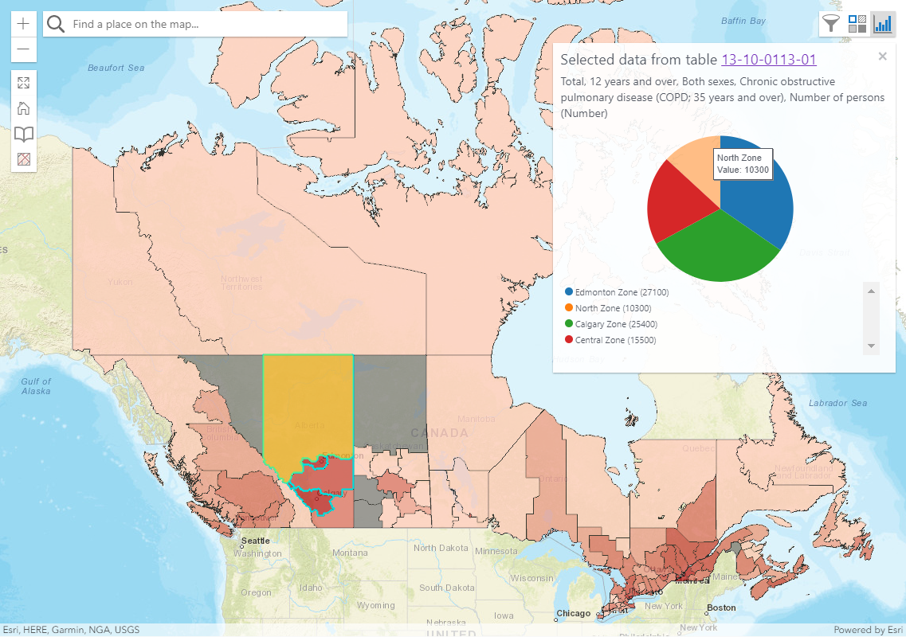
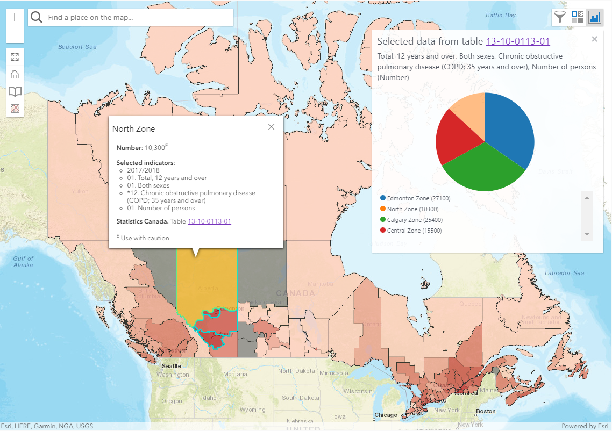

## Welcome 

This page provides some background into the work I was a part of during my casual contract at [Statistics Canada's](https://www.statcan.gc.ca/eng/start) [Statistical Geomatics Centre](https://www12.statcan.gc.ca/census-recensement/2016/geo/index-eng.cfm) as a GIS Web Developer. 

My role was to support the front-end development of the Canadian Statistical Geospatial Explorer (CSGE) and it's API. I mainly focused on the [Geo-Explorer](https://github.com/SGC-CGS/geo-explorer), [Geo-Explorer API](https://github.com/SGC-CGS/geo-explorer-api), and [bundler](https://github.com/SGC-CGS/bundler). However, I was also involved in some of the other repositories for code reviews, peer-coding, and feedback. 

## Table of Contents
- Software / Tools
  - IIS Express
  - Visual Studio Code IDE
- Languages / APIs / Libraries
  - JavaScript / HTML / CSS
  - ArcGIS REST JS and API for JavaScript
  - D3JS
- Work Environment
  - Agile
- The Canadian Statistical Geospatial Explorer
  - Widgets
    - Select Data
    - Styler
    - Charts
    - Bookmarks
    - Export
    - Map and Chart Hover
    - Use of web storage 
- Documentation 
- Acknowledgements

## Software
#### IIS Manager

Microsoft Window's Internet Information Services (IIS) enables server requested pages to reach your Windows system. In the case of the CSGE, ASP.NET server technology is required for building the full stack GIS web application with JavaScript / HTML / CSS. 

#### Visual Studio Code IDE

[Visual Studio Code](https://code.visualstudio.com/) is an integrated development environment (IDE) for developing software. IDEs are powerful because they offer complex developer tools (write code, compile code, and debug) in a single GUI. 

## Languages / APIs / Libraries

#### JavaScript / HTML / CSS

In web development, [HTML](https://html.com/) provides the structure for web pages, and is enhanced by [JavaScript](https://www.javascript.com/) and [CSS](https://en.wikipedia.org/wiki/CSS). JavaScript allows for more interactive web pages, and CSS helps with styling. 

#### ArcGIS REST JS and API for JavaScript

Developed by **[Esri](https://www.esri.com/en-us/home)**, the [ArcGIS JavaScript](https://developers.arcgis.com/javascript/latest/) and[ ArcGIS REST JS](https://developers.arcgis.com/arcgis-rest-js/) web APIs allow developers to build 2D and 3D browser-based mapping applications to provide users with an interactive experience. Additionally, the ArcGIS REST JS API utilizes [ArcGIS Enterprise](https://www.esri.com/en-us/arcgis/products/arcgis-enterprise/overview) for mapping, analytics, data hosting, and content management. In the case of the CSGE, geographic content and services are hosted within the government's infrastructure. 

#### D3JS

[D3JS](https://d3js.org/) is a JavaScript library for data visualization. In the CSGE, D3JS is used for developing interactive bar charts, pie charts, line charts, and scatter plots. 

## Work Environment 

#### Agile

[Agile](https://en.wikipedia.org/wiki/Agile_software_development) work environment's offer flexibility for employees and customers. As customer needs evolve, the development of the product also evolves in an iterative and incremental way. In this environment, the scrum framework is to organize teams to focus on certain features within a period of time (i.e., sprints). As part of scrum, there are daily scrum and occasional sprint planning meetings. Daily scrum meetings go over how things are progressing and if something needs addressing. The sprint planning meetings discuss tasks to take on for the period of the sprint and by the end of the sprint, the team goes into sprint review to provide feedback, ideas for improvement, and go over the work completed. 

## The Canadian Statistical Geospatial Explorer

The main goal of the [CSGE](https://github.com/SGC-CGS) is to allow subject matter experts to analyze and grab data from a map-based UI. The development of the CSGE is split into various parts: 
- [Geo-Explorer API](https://github.com/SGC-CGS/geo-explorer-api)
  - Provides the common code for geo-explorer sites
- [Geo-Explorer]((https://github.com/SGC-CGS/geo-explorer))
  -  The heaviest geo-explorer site rich with features, unlike the [Geo-Explorer Lite](https://github.com/SGC-CGS/geo-explorer-lite)
- [Geo-Explorer Proxy](https://github.com/SGC-CGS/geo-explorer-proxy)
  - A .NET proxy for handling client requests for resources
- [Geo-Geocoder using Pelias](https://github.com/SGC-CGS/geo-geocoding)
  - Take a text description and return an address
- [Bundler built with Rollup](https://github.com/SGC-CGS/bundler)
  - Provide cross-browser compatibility for geo-explorer sites

#### Features 

The features I'm highlighting below are ones I was tasked with continuing or producing. By the time you read this document the designs below may not match the current state of the CSGE as it is constantly evolving. 

**Select Data**

This widget is used for selecting data to display and interactive with in the map. It uses typeahead boxes as there can be an extensive amount of data to choose from. 

**Styler**

The classification legend in the styler shows how data is grouped within the map. There are three methods for calculating breaks in the data:
- Equal Intervals
- Natural Breaks
- Quintiles 

There is also the option to set the number of breaks. The standard approach is to use between 4 and 6 classes. 5 classes is the default since diverging color schemes do not look great with an even number of classes as the middle break is where the diverging occurs. 

A visibility toggle is on the classification legend for the purpose of making holes in a break. You can see how this looks in the image below.

The color scheme picker is where users can make changes to the color scheme of the dataset as they may prefer not to use the default. 

Additionally, users can show labels for the features in the layer on the map and change the overall opacity of the layer on the map.

**Charts**

In this widget, the chart button cannot be clicked until features on the map have been selected since the chart would not yet have been drawn. Once features have been selected, a chart will appear. In this document, only the bar chart and pie chart will be shown.

The elements in any chart can be highlighted for additional information. When a chart element is highlighted, so is it's respective feature and vice versa.

**Bookmarks**

**Export**

**Map and Chart Hover**

**Use of Web Storage**

## Documentation

[JSDocs](https://jsdoc.app/) was used to provide a standardized way of writing comments in the CSGE. Microsoft Word was used to describe complex features in the CSGE as there can be a steep learning curve with all the concepts and patterns. 

#### Acknowledgements 

[Statistics Canada](https://www.statcan.gc.ca/eng/start)

[Statistical Geomatics Centre](https://www12.statcan.gc.ca/census-recensement/2016/geo/index-eng.cfm)

[Bruno St-Aubin](https://github.com/staubibr)

